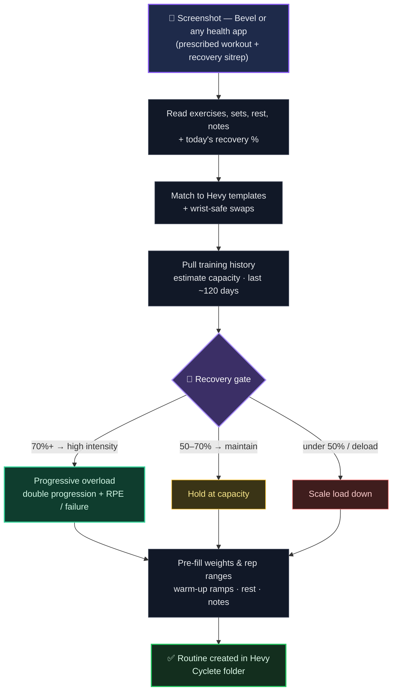

<div align="center">

# 🏋️ HevyHelper

**Paste a workout screenshot → get a recovery-aware, progressively-overloaded [Hevy](https://www.hevy.com/) routine, built from your own training history. Automatically.**


</div>

HevyHelper turns a single screenshot into a ready-to-train Hevy routine. There's no manual routine building: you paste in what your health app prescribed for today, and the agent reads it, adapts it to how recovered you are, weights it from your logged history, and writes the finished routine straight to Hevy.

---

## ⚡ How it works

The input is a screenshot from **Bevel — or any other health/recovery app**. Bevel is an AI health app that puts two things in the same view:

1. **Today's prescribed workout** — the exercises, sets, and rep targets.
2. **A recovery "sitrep"** — where your body is right now, e.g. "100% recovery", "CNS deload — 50% load reduction", or RPE targets.

Both live in the screenshot, so one paste carries the plan *and* the readiness. HevyHelper is **screenshot-driven** — it reads the app's output that you paste in. It does not talk to Bevel directly; the only external API it calls is Hevy's.

From there it's automatic:



### Example

Paste a Bevel screenshot showing today's **push day at 100% recovery**. HevyHelper:

- reads the prescribed presses and **swaps the barbell bench for a neutral-grip dumbbell press** (wrist-safe — see below), noting the swap;
- pulls your recent history for each lift and estimates your current **capacity**;
- sees recovery is above 70%, so it **applies progressive overload** — nudging load or reps beyond recent capacity where your last session earned it;
- pre-fills each working set's `weight_kg` and rep-range target, prepends a warm-up ramp, sets rest by exercise type, and carries your form cues into the notes;
- writes the finished routine to your Cyclete folder.

The same screenshot at a lower recovery reading produces a lighter session — same exercises, scaled to the day.

---

## 🧠 What makes it smart

These behaviors are encoded in the agent spec:

🔋 **Recovery gating.** You don't get the same routine every time — you get the one that fits today. The recovery figure from the screenshot sets the tier: **above 70%** unlocks high-intensity, progressive-overload targets; **50–70%** holds and maintains; **below 50% (or an explicit deload)** scales the load down. Load only ever increases in the high tier.

📈 **History-based capacity.** Weights aren't copied from your last session, which may itself have been a reduced day. Instead the agent estimates your *capacity* — the near-max working weight across your last ~120-day training block — from `GET /v1/exercise_history/{id}`, with guards against stale PRs, one-off weight spikes, and genuine downtrends.

🔁 **Progressive overload — session to session, not set to set.** Within a workout every working set of a lift gets the *same* target weight and rep range (straight sets — never a pyramid or ascending scheme; the only in-session ramp is the warm-up). Progression happens **between workouts** via **dynamic double progression**: each lift has a rep range, and when your last session hit the top of that range on all working sets (at good recovery), the next routine adds load and resets reps to the bottom — otherwise it holds the weight and nudges reps up. Weights and ranges are **recomputed from your logged history every time**, so each routine builds on the last in a rolling loop (history → today's targets → you log it → history → next time). Step size is capped by exercise class (heavier compounds tolerate bigger jumps than light isolation), and the load-vs-reps decision reads your logged RPE and failure flags. The progression logic is grounded in cited meta-analyses and systematic reviews (see the spec).

🖐️ **Wrist-safe (ulnar) constraint.** Straight-barbell / locked-wrist presses (barbell bench, overhead press, and the like) are never programmed — they're swapped for neutral-grip dumbbell, machine, or cable equivalents, even when the screenshot prescribes the barbell version, with the swap noted on the exercise. Back squats and deadlifts are fine — they don't load the wrist in a locked push.

Alongside those, every routine also matches each exercise to a Hevy template (checking a cached registry before hitting the API, and creating a custom exercise only when nothing fits), pre-fills `rep_range` targets so Hevy shows a range rather than a single number, prepends automatic warm-up ramps (roughly 40 / 60 / 80% of the working weight), sets rest by how systemically fatiguing each lift is, and carries the screenshot's notes across.

---

## 🚀 Setup

1. Copy the example env file:
   ```bash
   cp .env.example .env
   ```
2. Get your API key from the Hevy web app (requires **Hevy Pro**): https://hevy.com/settings?developer
3. Paste it into `.env` as `hevy_API=...`.

> `.env` is gitignored — never commit it. The key is read in code (not via `source`), and an empty `api-key` header returns `401 InvalidApiKey` (that means "no key sent," not necessarily a bad key).

---

## 📁 Files

| File | Purpose |
|------|---------|
| [`AGENTS.md`](./AGENTS.md) | The operational agent spec — full workflow, algorithms, conventions, and API/schema reference. |
| [`AGENTS-enhanced.md`](./AGENTS-enhanced.md) | Audited, hardened revision of the spec (contradictions resolved, algorithms made deterministic). Promotion candidate for `AGENTS.md`. |
| [`AGENTS-AUDIT.md`](./AGENTS-AUDIT.md) | The audit that produced the enhanced revision — findings by priority and the fix applied for each. |
| [`EXERCISE-REGISTRY.md`](./EXERCISE-REGISTRY.md) | Cached common exercise → template-ID map (with provenance dates and wrist-safe flags), so matching is fast and doesn't always hit the API. |

---

## 🔌 API

The only external service is the **Hevy public API**. Base URL `https://api.hevyapp.com`, authenticated with the `api-key` header. Full docs: https://api.hevyapp.com/docs/

Endpoints used: `exercise_templates` (list/create), `routines` (create/update), `routine_folders`, and `exercise_history/{id}` (for the history-based weight pre-fill).
